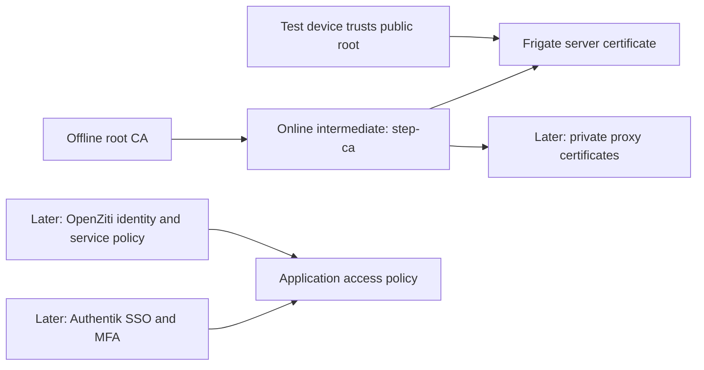

# Homelab PKI → identity → ZTNA

Updated: 2026-09-16. This is a proposed rollout, not a record of deployed controls.

## First outcome

Open one Frigate instance using HTTPS from one trusted test device, without a certificate warning. Use a dedicated Linux VM running Docker for the new CA. Stop at this milestone before adding more platforms.

The owner selected the demo NVision (Frigate fork) instance for the pilot. It is running and healthy. Use its authenticated TLS endpoint on port 8971 for the certificate exercise. Keep the existing public hostnames and certificates working during the experiment.

## How the pieces relate

PKI establishes trust in cryptographic identities. A root CA signs an intermediate CA, which signs server certificates. The root is normally self-signed; service certificates are CA-signed. Installing the public root certificate makes the client's trust explicit. The root private key never goes onto clients or application servers.

TLS provides encrypted transport and server authentication. Mutual TLS additionally authenticates the client with a certificate. Neither alone decides which application actions a user may perform.

SSO centralizes user login; MFA strengthens that login. ZTNA applies identity and policy to access to particular services, without granting trust simply because a device is on the LAN. PKI commonly supports ZTNA, but setting up a private CA is not a prerequisite for every ZTNA product: some manage their own PKI. SSO in front of a website is a useful control, but does not by itself establish a complete ZTNA architecture. See [NIST SP 800-207](https://csrc.nist.gov/pubs/sp/800/207/final).

## Product choices

| Role | Recommendation | Reason and tradeoff |
| --- | --- | --- |
| Private CA | Smallstep `step-ca`, open-source edition | Focused X.509 CA with automation and ACME support. Smaller name than Microsoft, but a practical way to learn transferable PKI skills with low operational overhead. No hosted plan required. |
| Identity provider, later | Authentik open-source edition | Fits existing NGINX proxy workflows and supports standard identity protocols. Keep the plan within free features. |
| Identity alternative | Keycloak | Strong option if enterprise identity product familiarity is the priority; supports OIDC, OAuth 2.0 and SAML. For applications without native federation, plan a separate compatible authentication proxy. Choose one IdP initially. |
| ZTNA, later | OpenZiti | Apache-2.0 platform with cryptographic identities and per-service policy. More components to learn; postpone until PKI and identity basics are working. Its internal PKI need not be replaced with the lab CA. |
| Proxy | Existing Nginx Proxy Manager | Reuse for a single pilot after direct Frigate HTTPS works. Certificate import and renewal integration must be checked against the installed version. |

The resume value comes from demonstrating X.509, trust chains, SANs, lifecycle automation, OIDC/SAML, MFA, and least-privilege policy—not from collecting product names. Microsoft AD CS would conflict with the free/open-source requirement. Avoid introducing a second CA or IdP just for branding.

References: [step-ca source/license](https://github.com/smallstep/certificates), [Smallstep production design](https://smallstep.com/docs/step-ca/certificate-authority-server-production/), [Authentik free features](https://goauthentik.io/pricing/), [Authentik licensing](https://github.com/goauthentik/authentik/blob/main/LICENSE), [Keycloak](https://www.keycloak.org/), [OpenZiti](https://github.com/openziti/ziti).

## Phase 0 — Inventory and decisions

- [x] Confirm SSH access to the specified Proxmox node.
- [x] Check VM/container inventory, storage and available memory without making changes.
- [x] Write the rollout and validation plan.
- [x] Select the GitHub repository: `flashdancee/home_pki_ztna`.
- [x] Prepare initial documentation for GitHub sync on `main`.
- [x] Select the demo Frigate instance as the pilot target.
- [x] Select Firefox on the owner's current PC; owner agrees to guided public-root certificate installation.
- [x] Create and validate the `nvision.home.arpa` Pi-hole record; Firefox reaches the expected self-signed certificate warning on port 8971.
- [x] Inspect the selected NVision version, Compose/configuration, authentication and TLS behavior.
- [ ] Inspect camera, MQTT, storage and other integrations before changing or restarting NVision.
- [ ] Identify Pi-hole and Nginx Proxy Manager management endpoints and versions.
- [x] Allocate Proxmox VM 112 and reserve its address in phpIPAM.
- [ ] Permit required outbound package/image access for the new VM and validate time synchronization.

Discovery: the target Proxmox node is accessible and has approximately 24 GiB available memory and 128 GiB available thin storage. These are a point-in-time observation, not a capacity reservation. Its bridge is `vmbr0`. The demo runs NVision with Frigate core version 0.17.0. The container is healthy. Its port 8971 endpoint uses the default self-signed Frigate certificate and rejects an unauthenticated API request; port 5000 accepts the same API request without authentication. Use 8971 for the pilot and later restrict port 5000 to required integration sources. Portainer's screenshot marks the GPU Docker endpoint down, but that does not prove the host itself is down; investigate only if it affects the chosen pilot. NPM status badges likewise do not establish backend application health.

Keep concrete IP allocations, credentials, internal host inventory and raw exports in ignored `local/` material rather than the publishable plan.

## Phase 1 — Dedicated CA VM and one Frigate certificate

### Infrastructure

VM `security-lab-01` has been created from a checksum-verified official Debian 13 cloud image with 2 vCPU, 2 GiB RAM and 20 GiB disk. It uses an SSH key and starts automatically with Proxmox. This is a PKI starting size, not sizing for the entire roadmap. The static address is recorded outside the public repository. Base installation is paused because the new address can reach its gateway and resolve public DNS, but cannot reach public IPv4 HTTP/HTTPS or ICMP destinations. Correct the gateway/firewall egress policy before installing the guest agent, Docker Engine or Smallstep. Validate time synchronization afterward.

Run only `step-ca` and, if needed, a Portainer agent initially. Connect it to the existing Portainer server as a new environment; verify server/agent version compatibility. Restrict agent access to the management server and SSH to administrator sources. Do not publish Docker's unauthenticated API. Account for Docker's published-port firewall behavior and validate reachability from an unauthorized source.

Use an offline encrypted root key and an online intermediate key. Keep encrypted recovery copies outside the VM; a VM snapshot is not an offline root backup. Restrict intermediate-key access and understand that Docker/Portainer administrators with host control can access the online CA. No root key in a running container, Git repository, or routine VM backup.

### DNS and certificate

Internal names: `ca.home.arpa` and `nvision.home.arpa`. The NVision record has been created and validated against the expected pre-PKI certificate warning. Add the CA record after reserving the new VM's address. The CA name resolves to the new VM; the NVision name resolves directly to the selected NVision host for this phase. A private CA does not require purchasing a domain or exposing an ACME challenge to the internet.

Issue one certificate with the exact DNS name in its Subject Alternative Name (SAN). Add an IP SAN only if direct-IP HTTPS is an explicit requirement. Generate the leaf private key on the service host where practical and submit a CSR; never distribute the CA signing key. Choose and document a short pilot validity period that fits the renewal schedule. Do not assume step-ca defaults produce a certificate that lasts months.

Install the public root certificate on one test device after independently checking its fingerprint. Confirm browser-specific trust behavior. Devices that have not been configured to trust this CA will still reject its certificates.

The selected client is Firefox on the owner's current PC. Follow [FIREFOX_TRUST.md](FIREFOX_TRUST.md) together once the CA certificate and its verified fingerprint are available.

For Frigate 0.17, the documented certificate directory is `/etc/letsencrypt/live/frigate`, with `fullchain.pem` and `privkey.pem`. Confirm that the NVision fork retains this behavior before mounting anything. Mount the certificate directory read-only, supply the leaf plus intermediate chain, and keep TLS enabled on authenticated port 8971. Preserve authentication; port 5000 is an unauthenticated internal endpoint in this deployment and is unsuitable for the browser pilot. See [Frigate TLS](https://docs.frigate.video/configuration/tls/) and [authentication](https://docs.frigate.video/configuration/authentication/).

Check existing HTTP upstreams before enabling TLS: a proxy still forwarding HTTP to a now-HTTPS port will fail. If the pilot requires changing an existing backend listener, update and validate dependent proxy connections in the same change, with a saved rollback configuration.

### Acceptance tests

- [ ] CA health check verifies using its pinned root; issuance works for the intended name.
- [ ] `openssl s_client` verifies the served chain and hostname using the root certificate.
- [ ] `curl --cacert` succeeds without `-k`; browser succeeds without bypassing a warning.
- [ ] The chosen browser works after installing the public root into its applicable trust store.
- [ ] A client without the lab root rejects the chain; a wrong hostname fails verification.
- [ ] Frigate still requires login; live video and existing integrations work.
- [ ] A second issuance/replacement is observed at the service and survives a restart.
- [ ] Record expiry, fingerprint, SANs and validation evidence with private details removed.

Rollback: preserve the previous Compose/config and certificate directory; restore those and the prior TLS/upstream settings together, then retest the old URL. Remove only pilot DNS/trust entries if retiring the experiment. Do not restore stale CA state casually after further issuance.

## Phase 2 — Renewal and one reverse-proxy pilot

First automate Frigate renewal with `step` or a compatible ACME client. Use restricted issuance policy, protected credentials, atomic certificate replacement and a tested reload mechanism. Current Frigate documentation describes automatic certificate reloads; verify this on the deployed release. Alert on renewal failure and expiry, and test a restore before expanding use.

Then add one separate internal proxy hostname using a CA-issued custom certificate. Validate the installed NPM custom-certificate workflow and build renewal/import/reload automation appropriate to that release; do not assume its Let's Encrypt UI supports an arbitrary private ACME directory.

Treat browser → proxy and proxy → Frigate as separate TLS connections. The proxy must trust the CA, send the correct SNI name and verify the upstream hostname. Encryption with upstream certificate verification disabled does not establish backend identity. Test that an incorrect upstream name or untrusted certificate is rejected. Avoid editing generated NPM files that are overwritten on reload.

Keep public Let's Encrypt certificates for family/public clients unless each client is deliberately enrolled in private trust. TVs and mobile apps can have separate trust stores or certificate restrictions. Private CA certificates are not automatically a security improvement over publicly trusted certificates; the learning benefit is controlling issuance and trust.

Acceptance: automated renewal changes the certificate actually served on both relevant TLS legs; expiry monitoring works; another proxy host remains unchanged; rollback restores the previous certificate and route.

## Phase 3 — SSO and MFA for one application

Deploy Authentik on the dedicated lab VM only after reviewing its current resource requirements and resizing if necessary. Use a disposable web app first. Configure one administrator, one allowed user/group, one denied user and MFA with tested recovery. Prefer native OIDC where the application supports it; otherwise evaluate Authentik's proxy integration with NPM.

Authentication at the proxy and authentication inside Frigate are distinct. Keep Frigate's own login initially. Do not assume a proxy login automatically maps users or roles inside the application. Restrict alternate backend routes before claiming SSO is enforced. Preserve a documented management recovery path.

Acceptance: allowed user succeeds with MFA, denied user fails, logout/session behavior is understood, direct backend access cannot bypass the intended control, and logs explain the decision. Check API, mobile and video flows separately. Reference: [Authentik NGINX integration](https://docs.goauthentik.io/add-secure-apps/providers/proxy/server_nginx/).

## Phase 4 — One actual ZTNA service

Pilot self-hosted OpenZiti with one test service and one enrolled client. Start on the LAN to learn identity and service policy; external reachability and router/firewall design are a separate later decision. Use its supported internal PKI initially. A second new VM may be appropriate to separate access infrastructure from the CA once this phase begins.

Create narrowly scoped dial/bind permissions, default-deny access, and one allowed identity. Avoid broad subnet access. For the test service, restrict conventional ingress so users cannot bypass the overlay. Preserve explicit administrator recovery access and document this exception. Device posture and IdP integration are later experiments, not assumed capabilities already configured.

Acceptance: enrolled authorized client reaches only the intended service; unauthorized identity fails; conventional backend access fails from the test client; unrelated LAN services remain inaccessible through the overlay; disabling the identity removes access, including testing existing sessions. Document relevant audit evidence. Reference: [OpenZiti identities and PKI](https://openziti.io/docs/learn/core-concepts/identities/overview/).

## Phase 5 — Optional experiments and portfolio evidence

Choose one at a time:

- Mutual TLS on a disposable admin website: compare server-only TLS with client certificate authentication.
- Certificate compromise drill: replace a leaf key, test renewal denial/revocation behavior and explain the limits of client revocation checking. Do not claim revocation guarantees that were not tested.
- CA recovery: restore the intermediate service in isolation and verify trust continuity; then document root/intermediate rotation.
- SSH certificates for a disposable VM, separate from the initial HTTPS exercise.
- Identity-based access for one useful service, then test denial and recovery before expanding.

For each completed phase, save a sanitized diagram, version list, decision record, positive/negative test results and rollback notes. Example resume bullets to use only after completion:

- Built a private X.509 PKI using an offline root and online intermediate CA; automated certificate renewal and validated TLS trust for containerized services.
- Integrated application SSO and MFA with group-based access policies and tested authentication-bypass controls.
- Implemented a service-scoped ZTNA pilot using cryptographic identities, default-deny policy and access-removal tests.

## GitHub handoff

The owner selected [flashdancee/home_pki_ztna](https://github.com/flashdancee/home_pki_ztna). The remote had no branches at the initial sync check. Sync the documentation and ignore rules on `main`; keep concrete pilot details in ignored `local/` notes. Repository visibility has not been verified. Review staged content before each push. Use an explicit automation author for the initial documentation commit because the global Git author appears unrelated to this project; leave global settings unchanged.

Never commit CA state, private keys, tokens, passwords, full application configs containing secrets, raw screenshots showing household details, or backup archives. `.gitignore` is a guardrail, not a substitute for reviewing the staged diff.
