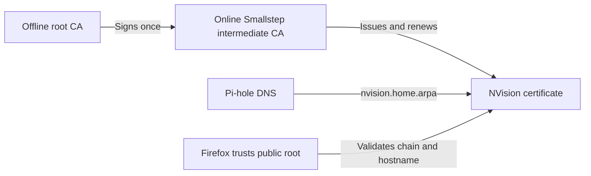

# PKI Architecture and Enterprise Mapping

## What this project does

This lab gives an internal NVision service a trusted HTTPS identity without using a public certificate authority.

The result is `https://nvision.home.arpa:8971` without a certificate warning. HTTPS encrypts the connection and proves that the server owns a certificate authorized for that hostname. NVision authentication remains a separate control.

## Trust chain

The PKI has three certificate levels:

1. **Root CA:** the long-lived trust anchor. Its encrypted private key was generated outside the CA VM, used to sign the intermediate, backed up offline, and removed from the working PC. Clients receive only its public certificate.
2. **Intermediate CA:** the online signing authority operated by Smallstep `step-ca`. Its encrypted key remains on the dedicated CA VM. Compromise of this tier can be recovered without replacing the root trust anchor.
3. **Leaf certificate:** the short-lived NVision server certificate containing `nvision.home.arpa` and its IP address as Subject Alternative Names.

Firefox trusts the public root. When it connects to NVision, it validates the leaf signature, intermediate chain, hostname, validity period, and permitted certificate uses.

## Issuance and renewal

The NVision private key is generated on the NVision host and never sent to the CA. A Certificate Signing Request contains the public key and requested names. Smallstep verifies the request and returns a signed leaf certificate.

Leaf certificates are valid for 24 hours. A restricted renewal container authenticates with the current certificate and key, renews every eight hours, and atomically rebuilds `fullchain.pem`. It has no CA private key or provisioner password. NVision detects the changed certificate and reloads its internal NGINX process without restarting the application.

The implementation was tested for:

- correct chain and hostname validation;
- rejection by a client without the root;
- rejection of an incorrect hostname;
- continued NVision authentication enforcement;
- renewal, certificate reload, and CA restart persistence.

## Component responsibilities

| Component | Responsibility |
| --- | --- |
| Offline storage | Protect the root private key and recovery password. |
| Smallstep CA VM | Protect the intermediate key; issue, renew, and record certificates. |
| Pi-hole | Resolve private `home.arpa` names to internal services. |
| NVision host | Protect its leaf private key and serve the certificate chain. |
| Firefox | Trust the public root and validate the server certificate. |
| GitHub repository | Store deployment code and documentation, never keys, passwords, or CA state. |

## How this maps to an enterprise

| Homelab implementation | Typical enterprise equivalent |
| --- | --- |
| Encrypted offline root files | Offline root CA protected by an HSM, vault, ceremonies, and split administrative control. |
| One Smallstep intermediate | Multiple issuing CAs separated by environment, region, or certificate purpose. Common products include Microsoft AD CS, Smallstep, EJBCA, or managed cloud private CAs. |
| Pi-hole local DNS | Enterprise DNS/IPAM with controlled zones, change management, and redundant resolvers. |
| Manual Firefox root import | Root distribution through Active Directory Group Policy, MDM, configuration management, or managed browser policy. |
| NVision renewal sidecar | ACME, SCEP, EST, cert-manager, service-mesh agents, or endpoint-management enrollment. |
| Docker volume key storage | HSM, TPM, KMS, secrets manager, or tightly controlled filesystem identity. |
| Manual validation | Central monitoring for expiry, issuance failures, CA health, audit events, and policy violations. |
| One CA VM | Redundant issuing CAs, protected databases, tested backups, disaster recovery, and documented rotation procedures. |

Enterprise PKI also defines certificate policies: who may request a certificate, permitted names and key types, maximum lifetime, revocation behavior, audit retention, administrative roles, and incident response. Network controls should limit access to CA management and enrollment endpoints.

## Relationship to ZTNA

PKI provides cryptographic identities and encrypted transport. ZTNA consumes identities and context to decide which user, device, or workload may reach a specific service. A certificate can therefore support ZTNA, especially for device or workload identity, but HTTPS alone is not ZTNA.

Later phases add SSO/MFA and an OpenZiti service policy. Those controls will answer **who may connect**; this PKI phase establishes **which systems and certificates can be trusted**.

## Current boundaries

This remains a learning deployment. The issuing CA is a single VM, its intermediate key is filesystem-backed, certificate-expiry alerting is pending, and recovery and missed-renewal drills have not yet been completed. The root backup must remain offline and tested before this PKI is expanded to important services.
